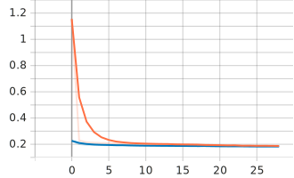

<!-- badges  -->

# Read Between The Wines 🍷

This hack was created for [MAIS Hacks 2022](https://maishacks.com). Our project aims to help consumers make informed choices about the quality and price of wine. 

This project was created with ❤️ by [Nathalie](https://github.com/nredick), [Lekima](https://github.com/LekiYak), & [Yasha](https://github.com/Jashani).
## Inspiration 💡 

Coming into the hackathon, we challenged ourselves to work with geospatial data. After some brainstorming, we came across [this dataset](https://www.kaggle.com/zynicide/wine-reviews) on Kaggle. 

The idea snowballed to where we are now.

## What it does 🖊 

*Read Between the Wines* is an interactive platform designed to provide users with a comfortable interface to truly understand the quality of their wine of choice.

Consequently, it allows users to further explore their options and get a deeper understanding of the no-no juice.

Users can input a wine of their choice by entering the year and the winery that produced it. The neural network then predicts the quality and price of the wine based on the climatological conditions of the growing season in which it was produced. 

## How we built it ⚙️ 

### ***The data***
For our project to be realized, we had to first engineer our own dataset. The wine dataset was parsed for the year and the winery, province, and country each sample wine was produced in.

The [`geocoder`](https://github.com/DenisCarriere/geocoder) API was used to interface with ArcGIS to encode the string locations of wineries and retrieve their latitude and longitude coordinates.

> Quinta dos Avidagos Winery Douro Portugal -> 41.400990000000036 / -7.30753999999996

Once we had the year the wine was produced (parsed from the description with regex), we used the [`Google Earth Engine`](https://earthengine.google.com) Python API to retrieve the climatological conditions of the growing season in which the wine was produced from the [ERA5-Land Monthly Averaged - ECMWF Climate Reanalysis](https://developers.google.com/earth-engine/datasets/catalog/ECMWF_ERA5_LAND_MONTHLY) dataset.

**Features:** 
- Temperature of the Earth's surface 
- Dewpoint (humidity)
- Volumetric soil water 
- Surface air pressure 
- Total precipitation
- Wind speed
- Maximum temperature variation over the growing season

**Targets:**
- Quality
- Price

### The model

The model was built using [`sci-kit learn`](https://scikit-learn.org/stable/) and [`tensorflow`](https://www.tensorflow.org). A `sklearn` pipeline was used to preprocess the data and apply normalization and feature selection. 

The model was then trained using a `Sequential()` neural network built with `tensorflow` with 7 hidden layers. We used the [`Nadam`](https://www.tensorflow.org/api_docs/python/tf/keras/optimizers/Nadam) optimizer and [`mean squared logarithmic error`](https://scikit-learn.org/stable/modules/generated/sklearn.metrics.mean_squared_log_error.html) loss function.

<!-- > Mean squared logarithmic error was used because it performs well with data like prices -->

The `train_test_split` function was used to split the data into training and testing sets (80% training/20% testing). The model was then trained on the training set and evaluated on the testing set.

Validation data for training was randomly sampled from the training set (20%).

| Dataset | Split |
| --- | --- |
| Training | 60% |
| Testing | 20% |
| Validation | 20% |

### ***The backend***
<!-- todo -->
### ***The frontend***
<!-- todo -->
## Challenges we ran into 🚨

* We tried to implement the frontend using Velo and discovered it is not permissive enough for our purposes. We therefore decided to build the frontend by ourselves.
* With plentiful data, we had to take the time to brainstorm and properly understand the best factors that might go into the quality of wine, in order to avoid cluttering our data with unnecessary information.
* We got kicked out of the university building at night and had to improvise a new work location till the morning 

## Accomplishments that we're proud of 🏆

*Everything!*
### How'd the model do? 📊

<!-- 
 -->

Accuracy & Loss 

Check out the interactive training & valiation metric plots on [Tensorboard](https://tensorboard.dev/experiment/kQRWX8RoROKEzNfro4EYMg/#scalars).

| Metric | Value |
| --- | --- |
| Test Loss | 0.171474 |
| Test Accuracy | 0.96141 |

We are extremely pleased with the results of our model. The model was able to predict the quality and price of the wine with an **accuracy of 96.14%**. However, the model is not accurate outside of the growing latitudes for wine grapes (50° to 30°) on each side of the equator); we don't anticipate this to be a problem for most users as almost no wine is produced outside of these latitudes.

- Not sleeping! (Although we probably should have)
- Our beautiful, interactive visualizations

## What we learned 🧠

- Frontend sucks (jk...)
- Building your own dataset is a lot of work
- *Velo* is hard to use with a custom domain name 
- Registering and integrating a domain name takes up to 48 hours!

We learned a lot about wine and the conditions that effect its quality. It turned into a small case study about wine and climate. 

## What's next for *Read Between the Wines* ➡️

> *Some wine-induced sleep.* 

- Create another model to predict how climate change will affect the quality of wine in the future.
- Retrain the model on the entire dataset. 
  - Due to computational and time constraints, the current model was trained on a subset of the data (33%). 
- Add more fun, interactive visualizations to the frontend.
- Allow users to select wine location on a map instead of entering the winery name.
- Add more features to the model, such as *red* or *white* wine. 
- Determine a better scale for the quality of wine.
  - Currently, the quality of wine is on a scale of ~80 to 100, which was given by the dataset. However, we believe that a scale of 1 to 5 would be more intuitive for users.
  - We didn't want to Min/Max scale because a wine with a quality of 80 is still a pretty good wine, so it didn't seem fair to call it a 1.
- Implement a more robust frontend.

## Built With 🔨

- Unmatched motivation 
- [`sci-kit learn`](https://scikit-learn.org/stable/) 
- [`tensorflow`](https://www.tensorflow.org)
- [`geocoder`](https://github.com/DenisCarriere/geocoder)
- [`Google Earth Engine`](https://earthengine.google.com)
